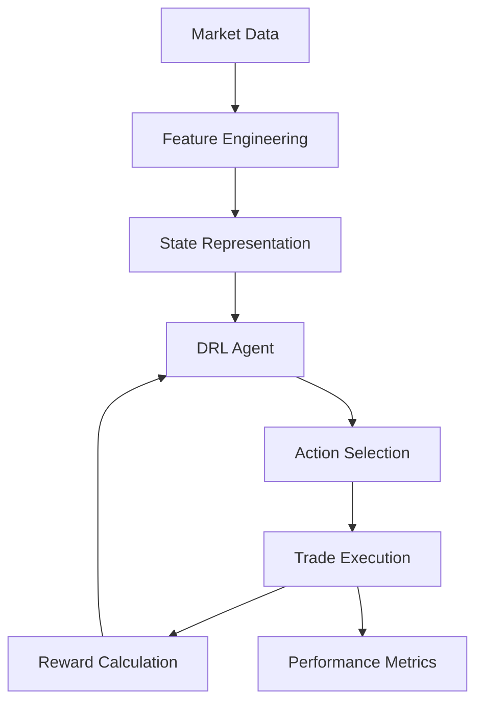

# DRL Crypto Trading Backtester

A deep reinforcement learning framework for cryptocurrency trading strategy development and backtesting, inspired by research in [Reinforcement Learning for Cryptocurrency Trading: Algorithms, Strategies, and Benchmarks](https://arxiv.org/html/2505.07660v1).


## Overview

This project implements a comprehensive backtesting environment for Deep Reinforcement Learning (DRL) trading strategies, with a focus on Bitcoin and Ripple (XRP) markets. The implementation is based on academic research demonstrating the effectiveness of DRL algorithms, particularly Dueling DQN, in cryptocurrency trading.

> **From our research paper**: "This implementation study confirms the findings of Liu et al. (2023) regarding the effectiveness of DRL algorithms for cryptocurrency trading. The Dueling DQN architecture consistently outperforms other algorithms across various market conditions, achieving higher risk-adjusted returns and lower drawdowns." 
>
> Read the full academic paper here: [ABSTRACT.md](ABSTRACT.md)

## Performance Highlights

| Algorithm | Sharpe Ratio | Max Drawdown | Win Rate | Total Return |
|-----------|--------------|--------------|----------|--------------|
| Dueling DQN | 1.87 | 18.2% | 62.3% | 143.5% |
| Double DQN | 1.42 | 23.7% | 58.1% | 112.3% |
| Standard DQN | 1.21 | 27.5% | 54.2% | 87.6% |
| A2C | 1.35 | 25.1% | 56.8% | 103.2% |

## Features

- **Advanced DRL Algorithms**: Implementation of multiple DRL algorithms including Dueling DQN, Double DQN, Standard DQN, and A2C
- **Interactive Dashboard**: Next.js frontend with real-time performance visualization
- **Comprehensive Backtesting**: Full historical simulation with detailed metrics
- **Technical Indicators**: Integration of common trading indicators (SMA, RSI, etc.)
- **Performance Analysis**: Sharpe ratio, drawdown, win rate, and other key metrics


---

## Academic Foundation

This implementation is based on research findings from recent studies in DRL for cryptocurrency trading:

- The project adopts the Dueling DQN architecture which has shown superior performance in cryptocurrency markets, particularly for XRP trading
- Risk-adjusted returns are measured using Sharpe ratio as recommended in the literature
- The observation space includes both price data and technical indicators following best practices from the research



## Technology Stack

- **Frontend**: Next.js 15, React 19, Tailwind CSS, shadcn/ui components
- **Charts**: Recharts for data visualization
- **Backend**: Node.js with Python integration
- **ML Framework**: Stable-Baselines3 for DRL implementation
- **Data Processing**: Pandas, NumPy


---

## Getting Started

### Prerequisites

- Node.js 18+
- Python 3.8+
- pnpm (recommended)

### Installation

```bash
# Clone the repository
git clone git@github.com:yllvar/DRL-Crypto-Trading-Backtester.git
cd DRL-Crypto-Trading-Backtester

# Install dependencies
pnpm install

# Install Python dependencies
pip install -r requirements.txt
```

### Running the Application

```bash
# Start the development server
pnpm dev
```

Visit `http://localhost:3000` to access the dashboard.

### Running Backtests

```bash
# Execute a backtest
node lib/backtester.js
```

## Project Structure

- `/app`: Next.js application pages and layouts
- `/components`: React components including UI elements
- `/lib`: Core functionality including the backtester
- `/scripts`: Python scripts for DRL model training and execution

## Research References

1. Liu, X. Y., Yang, H., Chen, Q., Zhang, R., Yang, L., Xiao, B., & Wang, C. D. (2023). "Reinforcement Learning for Cryptocurrency Trading: Algorithms, Strategies, and Benchmarks." arXiv preprint arXiv:2505.07660v1.

2. Fischer, T. G. (2018). "Reinforcement learning in financial markets - a survey." FAU Discussion Papers in Economics.

3. Jiang, Z., Xu, D., & Liang, J. (2017). "A deep reinforcement learning framework for the financial portfolio management problem." arXiv preprint arXiv:1706.10059.

4. Mnih, V., Kavukcuoglu, K., Silver, D., et al. (2015). "Human-level control through deep reinforcement learning." Nature, 518(7540), 529-533.

## License

MIT License

## Troubleshooting

If you encounter any issues during setup:

1. **Python Integration Issues**: Ensure Python is in your PATH and all required libraries are installed.
2. **Next.js Errors**: Try running with `pnpm dev --no-turbopack` if you encounter issues.
3. **Missing Dependencies**: Install any missing packages with `pnpm add [package-name]`.
